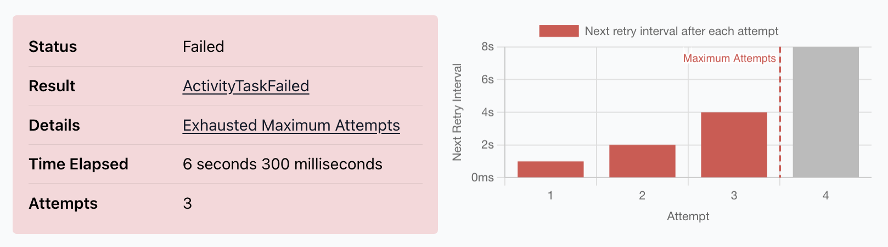

# 100 Temporal Mistakes

What we'll cover
- Activities: Errors, retries, idempotency, timeouts, worker disruption
- Workflows: Limitations, determinism, change versioning
- Recommendations to simplify working with Temporal day to day

Follow Along:

[Follow along: jacob.work/100TM](https://jacob.work/100TM)

<!-- Speaker notes:
The way this talk came to be is that a few years ago I got looped into a project at work to help launch a new product called Datadog Oncall (and I promise this is not an ad). But the reason the team came to me was because they were planning to build it on top of Temporal. At Datadog we always want to maintain a high standard of availability and so on for our services, but this had an even higher bar to meet than usual because we wanted be confident in allowing any core engineering team at Datadog to be able to route their own pages through this system despite the potential circular runtime dependencies that you can imagine making life difficult.

Now I've always enjoyed thinking about all the things that can theoretically go wrong in distributed systems. But suddenly I was fielding all kinds of questions from this new product team about activity execution semantics and retry policies and change versioning and parent close policies and so on, because the team was being so incredibly thorough. And as we were having these conversations, I was wishing that I had some way of capturing these tidbits in a way that could be digestible and simple to follow for anyone else using Temporal at our company.

So that is how 100 Temporal Mistakes was born, and my hope in preparing this talk is that I could shed light on some of the less obvious things that can go wrong, and also provide practical guidance that you can apply every day when developing Temporal backed applications.

Please note that the advice I'm giving is extremely picky. You certainly don't need to follow all of it, and some may not make sense at all depending on how you're using Temporal. That said, please feel free to roast me in the Q&A if you disagree with anything I say.

Also by the way for anyone who hasn't done the math yet, 100 mistakes in 35 minutes gives us about 20 seconds per mistake. So I'm just going to do a highlights tour, but you can find more content at the link on the slide.
 -->


---

# Part One: Activities

Activities are how Temporal workers interact with the outside world.

Activities must deal with:

- Downstream service errors
- Worker crashes & hangs
- Temporal server disruptions

<!-- Part One is all about activities. And I'm starting here because, let's face it, workflows are a bit more glamorous with their determinism and durability and signals and so on, but I think there's a lot of subtlety about how we need to design activities and the policy around them that is often glossed over when starting out with Temporal.

So activities have a lot of responsibility. They're the main window through which workflows are able to interact with the outside world. That means they also have to put up with all sorts of system disruptions that our workflow code can happily sleep through until it's time to be woken up again. -->


---

## Temporal's shared responsibility model for activities:

Temporal server provides an "at least once" execution semantic and retries activities by default.

It's on us to:

- Implement idempotency
- Gracefully handle cancelation
- Not amplify bad requests

<!--
The biggest way Temporal makes this easier for us, is by retrying activities by default. Specifically Temporal gives us an "at least once" execution semantic for every activity.

And that's really convenient, but Temporal can't magically ensure that our activities don't have undefined behavior if you run them more than once, or that they detect and handle cancelation, or that when there's a downstream service outage our retry policies don't conjure up a storm of attempts that only make matters worse.

So let's dive into how to write reliable, well-behaved activities.
-->


---

## Activities: Handling Downstream Service Errors

```go
func (w *Worker) ChargePayment(ctx context.Context, req ChargeRequest) (*ChargeResponse, error) {
    httpReq := newPaymentHTTPReq(req) // POST api.example.com/v1/payments/charge

    resp, err := w.httpClient.Do(httpReq)
    if err != nil {
        return nil, err
    }

    switch resp.StatusCode {
    case http.StatusOK:
        // Decode the response and return
        var cr ChargeResponse
	    err = json.NewDecoder(resp.Body).Decode(&cr)
	    return &cr, err
    default:
        return nil, fmt.Errorf("unexpected http status: %s", resp.StatusCode)
    }
}
```

<!-- We'll start out with a common example; this is an activity that's responsible for charging a customer through a payments API.

And you can see there are already a few places where we might return an error. So one of the first things we need to consider is whether there are types of failure conditions that shouldn't result in the activity being retried.
-->


---

## Activities: Avoid Amplifying Invalid Requests

```go
func (w *Worker) ChargePayment(ctx context.Context, req ChargeRequest) (*ChargeResponse, error) {
    // Send the request ...

    switch resp.StatusCode {
    case http.StatusOK: /* ... */
    case http.StatusBadRequest:
        return nil, temporal.NewNonRetryableApplicationError(resp.Status, "http_400", nil)
    default:
        return nil, fmt.Errorf("unexpected http status: %s", resp.StatusCode)
    }
}
```

<!--
One of those conditions would be if the payments API responds with a "Bad Request" HTTP status code. Assuming that retrying won't change the shape of the request being sent, we should probably update our activity to translate this into a non-retryable error so that the activity fails fast.
-->


---

## Activities: Avoid Overloading Services With Retries

<!-- Updated code example for HTTP 429: prefer the server's Retry-After hint (RFC 7231 §7.1.3 -- delta-seconds or HTTP-date) when present, and fall back to activityhelpers.GetNextRetryDelay with a minimum backoff coefficient of 3 so retries against the rate-limited endpoint back off more aggressively than the workflow's default policy. -->
```go
func (w *Worker) ChargePayment(ctx context.Context, req ChargeRequest) (*ChargeResponse, error) {
    // Send the request ...

    switch resp.StatusCode {
    case http.StatusOK: /* ... */
    case http.StatusBadRequest: /* ... */
    case http.StatusTooManyRequests:
        // Honor the server's hint when present; otherwise back off
        // more aggressively than the policy's default.
        delay := activityhelpers.ParseRetryAfter(resp.Header.Get("Retry-After"), time.Now())
        if delay == 0 {
            delay = activityhelpers.GetNextRetryDelay(ctx) * 2
        }
        return nil, temporal.NewApplicationErrorWithOptions(resp.Status, "http_429",
            temporal.ApplicationErrorOptions{NextRetryDelay: delay})
    default:
        return nil, fmt.Errorf("unexpected http status: %s", resp.StatusCode)
    }
}
```

<!-- It's also possible that there is a problem with the downstream API service provider or we are approaching a rate limit. In that case an error might be retryable, but we should increase our backoff time before the next retry to avoid making the problem worse.

So now our activity checks for the TooManyRequests HTTP status and calculates a next retry delay based on the `Retry-After` HTTP response header if it has been set. Otherwise we can just increase the next retry delay be a factor of 2.
-->


---

## Activities: Weathering System Outages

<!-- New code example, this time showing the workflow code that invokes the payment activity. Set a 30s start to close timeout and a 1m schedule to close timeout. -->
```go
func (w *Worker) PurchaseItem(ctx workflow.Context, req PurchaseRequest) (*PurchaseResponse, error) {
    // ... generate a charge request for the item & customer

    ctx = workflow.WithActivityOptions(ctx, workflow.ActivityOptions{
        StartToCloseTimeout:    30 * time.Second,
        ScheduleToCloseTimeout: time.Minute,
        RetryPolicy: { /* ... */ },
    })
    resp, err := workflowhelpers.AwaitActivity(ctx, w.ChargePayment, chargeRequest)

    // ...
}
```

<!-- If we switch contexts to the workflow code that is invoking our ChargePayment activity, we need to think about what timeouts and retry policy makes sense for what the activity does.

In this case we've started with a 30 second Start To Close timeout because we're not doing any computation in the activity and we expect the payments API to respond fairly quickly.

We've also set a 1 minute Schedule To Close timeout, which should be plenty of time to do a few retries if the activity fails quickly.

But we also need to consider the worst case: what if our worker, or the payments API, are down for an extended period of time? Would it be preferable for our workflow to observe that the activity has timed out after 1 minute, or is it better to allow more time for an outage to be resolved and for the activity to complete successfully?
-->

<!-- Speaker note: Temporal is great at retrying activities, but it's still important to think carefully about how we configure timeouts and retry policies in order to survive worst case system outages. For example here I'm invoking my activity with a schedule to close timeout that doesn't give much room for the activity to be retried if the worker or downstream API are temporarily unavailble. -->


---

## Activities: Weathering System Outages (continued)

<!-- Update the schedule to close timeout to 1h in the code example. Include code comment saying "allow retrying for up to 1 hour". -->

```diff
 func (w *Worker) PurchaseItem(ctx workflow.Context, req PurchaseRequest) (*PurchaseResponse, error) {
     // ... generate a charge request for the item & customer

     ctx = workflow.WithActivityOptions(ctx, workflow.ActivityOptions{
         StartToCloseTimeout:    30 * time.Second,
-        ScheduleToCloseTimeout: time.Minute,
+        ScheduleToCloseTimeout: time.Hour, // allow retrying for up to 1 hour
         RetryPolicy: { /* ... */ },
     })

     resp, err := workflowhelpers.AwaitActivity(ctx, w.ChargePayment, chargeRequest)
     // ...
 }
```

<!-- In this case, let's say we want to be able to recover after outages lasting up to about an hour.

We can allow this by updating the ScheduleToClose timeout to an hour, which means there's a much larger window for incidents to be resolved through activity retries without the workflow ever straying from its happy path. And because we're categorizing the errors returned from the activity function as retryable vs. not, we also don't need to worry so much about the tradeoff between failing fast and having more time for system recovery.

So now we're ready to go, right?
-->

<!-- Speaker note: ScheduleToClose doesn't always need to be large. Long values (hours) make sense when the workflow should weather an extended outage and the caller is OK waiting, or is notified asynchronously. Short values (seconds to minutes) make sense when the workflow has a graceful degradation path, when reporting an error quickly is preferable to retrying through an outage, or when an upstream caller is waiting synchronously.
-->


---

## Activities: Weathering System Outages (continued)

<!-- Update code example, now adding a retry policy with MaxAttempts set to 3, initial backoff to 1s, backoff coefficient to 2, and max backoff to 30s. -->
```go
func (w *Worker) PurchaseItem(ctx workflow.Context, req PurchaseRequest) (*PurchaseResponse, error) {
    // ... generate a charge request for the item & customer

    ctx = workflow.WithActivityOptions(ctx, workflow.ActivityOptions{
        StartToCloseTimeout:    30 * time.Second,
        ScheduleToCloseTimeout: time.Hour, // allow retrying for up to 1 hour
        RetryPolicy: &temporal.RetryPolicy{
            MaximumAttempts:    3,
            InitialInterval:    time.Second,
            BackoffCoefficient: 2,
            MaximumInterval:    100 * time.Second,
        },
    })

    // ... execute the ChargePayment activity
}
```

<!-- Well, sort of. It turns out we were really thorough and also specified a retry policy. The problem here is that because we only allow a maximum of 3 attempts, in practice we exhaust our retries really quickly. -->


---

## Activities: Weathering System Outages (continued)



[docs.temporal.io/develop/activity-retry-simulator](https://docs.temporal.io/develop/activity-retry-simulator)

<!-- To inpect the behavior of your timeout and retry policy config, Temporal actually provides a nice little simulator which is helpful since there's some math involved.

If we plug in the policy from the previous slide, we can confirm that the activity could actually be marked as failed after only 6 seconds! Obviously this is way off our target of surviving outages up to 1 hour. -->


---

## Activities: Weathering System Outages (continued)

<!-- Comment out the MaxAttempts field in the code example. Include code comment saying "allow unlimited attempts until the ScheduleToClose timeout is reached". -->
```go
func (w *Worker) PurchaseItem(ctx workflow.Context, req PurchaseRequest) (*PurchaseResponse, error) {
    // ... generate a charge request for the item & customer

    ctx = workflow.WithActivityOptions(ctx, workflow.ActivityOptions{
        StartToCloseTimeout:    30 * time.Second,
        ScheduleToCloseTimeout: time.Hour,
        RetryPolicy: &temporal.RetryPolicy{
            // MaximumAttempts: 0, // unlimited; bound by ScheduleToCloseTimeout
            InitialInterval:    time.Second,
            BackoffCoefficient: 2,
            MaximumInterval:    100 * time.Second,
        },
    })

    // ... execute the ChargePayment activity
}
```

<!--
Of course we could increase the max attempts in our retry policy, and go back to the simulator to make sure there are enough attempts to reach our desired schedule to close timeout.

But I think a much simpler mental model is to skip setting maximum attempts at all, so that you automatically get as many retries as fit within your schedule to close timeout.

Note that if you need to you can still use retry policies to fine tune the initial and maximum retry intervals as needed such that you don't retry too frequently before the timeout is reached.

But for these additional properties of retry policies, I think Temporal already sets pretty good defaults for most use cases. And those are what we're looking at here: by default, the first retry happens 1 second after the first activity failure, and the interval doubles from there until it caps off at 100 seconds between each attempt.
-->


---

## Activities: Weathering System Outages (continued)

```go
func (w *Worker) PurchaseItem(ctx workflow.Context, req PurchaseRequest) (*PurchaseResponse, error) {
    // ... generate a charge request for the item & customer

    ctx = workflow.WithActivityOptions(ctx, workflow.ActivityOptions{
        StartToCloseTimeout:    30 * time.Second,
        ScheduleToCloseTimeout: time.Hour,
    })

    // ... execute the ChargePayment activity
}
```

<!--
So the last tweak we'll make to the activity options is simply to remove the retry policy, and use the Temporal default of unlimited attempts and exponential backoff.

Just to be clear though: I'm not saying you should never specify retry policy or that it is necessary to always have a long schedule to close timeout. But it is important to have a target in mind for how long your activity should be capable of retrying during a disruption, and to verify that your retry policy meets that goal.
-->


---

## Activities: Implementing Idempotency

> Idempotence is the property of certain operations in mathematics and computer science whereby they can be applied multiple times without changing the result beyond the initial application.

[wikipedia.org/wiki/Idempotence](https://en.wikipedia.org/wiki/Idempotence)

<!--
A term that gets thrown around a lot when talking about activities is idempotency. This just means that if you run an operation more than once with the same input, you should get the same result.

It turns out this is a really important property for activities to have, because they're getting retried all the time. And we really don't want to do something like charging a customer 20 times for the same purchase just because there was a temporary system outage.
-->


---

## Activities: Implementing Idempotency

Common techniques to achieve idempotency:
- Passing idempotency key to external APIs
    - Derive a key from the Workflow ID and activity ID. Pass this to downstream systems (like Stripe) to ignore duplicate requests.
- Applying database constraints
    - Use `INSERT ... ON CONFLICT` or conditional writes to ensure records aren't created twice.
- Using naturally idempotent operations
    - Design side effects as state settings (Set to X) rather than increments (+1), or use upserts with fixed IDs.
    - May help to decompose into multiple activities.

<!-- 
Unfortunately implementing and testing for idempotency is still not a solved problem. But there are some common techniques, and if you're lucky your activities are interacting with external services which themselves are designed for idempotency.

In our activities, we still might need to come up with a stable identifier that remains the same across all attempts in order to deduplicate requests to downstream services or resources that the activity creates. ** TODO fix

Sometimes making an activity idempotent is really hard, until you split it up into multiple activities that are each invoked separately in the workflow.
-->


---

## Activities: Implementing Idempotency

Common techniques to achieve idempotency:
- Passing idempotency key to external APIs
    - Derive a key from the Workflow ID and activity ID. Pass this to downstream systems (like Stripe) to ignore duplicate requests.
- Applying database constraints
    - Use `INSERT ... ON CONFLICT` or conditional writes to ensure records aren't created twice.
- Using naturally idempotent operations
    - Design side effects as state settings (Set to X) rather than increments (+1), or use upserts with fixed IDs.
    - May help to decompose into multiple activities.
- ~~Setting `MaxAttempts: 1` in retry policy~~

<!-- I also want to note that, just in case you're thinking that it's ok to not have idempotent behavior if you set MaxAttempts to 1 in your retry policy, you should be aware that Temporal does not guarantee exactly once execution for activities. This has to do with the way server replication and failover works, so it's probably ok if you're self-hosting a single Temporal cluster but even that could change. -->


---

## Activities: Idempotency Keys

<!-- Back to the previous payment code example. Update the code to compute an idempotency key (using activityhelpers.GetIdempotencyToken) and add it to the request header (follow the example from stripe docs: https://docs.stripe.com/api/idempotent_requests). -->
```go
func (w *Worker) ChargePayment(ctx context.Context, req ChargeRequest) (*ChargeResponse, error) {
    httpReq := newPaymentHTTPReq(req) // POST api.example.com/v1/payments/charge
    httpReq.Header.Set("Idempotency-Key", getIdempotencyToken(ctx))

    // ... send the HTTP request & handle errors
}

func getIdempotencyToken(ctx context.Context) string {
	info := activity.GetInfo(ctx)
	key := fmt.Sprintf("%s:%s:%s", info.WorkflowExecution.ID, info.WorkflowExecution.RunID, info.ActivityID)
	return fmt.Sprintf("%x", sha256.Sum256([]byte(key)))
}
```

<!--
In our payment example from earlier, the activity is calling an API that supports the `Idempotency-Key` HTTP header.

So here I've add a function to generate an opaque string based on the workflow ID and activity ID, which will be the same across every activity attempt, while still being unique in case the same workflow scheduled multiple payment activities.

And then we can just pass that along to the payments API!
-->


---

## Activities: Natural Idempotency

<!-- New code example: An activity called RunKubernetesJob that starts a k8s job and waits for it to complete (two k8s API calls). The activity should accept a struct with Name and Namespace fields, and return a struct with a Status field (completed or failed) -->
```go
func (w *Worker) RunKubernetesJob(ctx context.Context, req RunJobRequest) (*RunJobResponse, error) {
    jobs := w.client.BatchV1().Jobs(req.Namespace)
    // Create the job
    if _, err := jobs.Create(ctx, &batchv1.Job{
        Name: req.Name,
    }); err != nil {
        return nil, err
    }

    // Poll for final status
    for {
        activity.RecordHeartbeat(ctx)
        j, err := jobs.Get(ctx, req.Name)
        if err != nil { return nil, err }
        if status := getJobStatus(j); status.IsTerminal() {
            return &RunJobResponse{Status: status}, nil
        }
        time.Sleep(15 * time.Second)
    }
}
```

<!-- In the real world, we also tend to have activities that perform multiple operations and interact with systems that don't have nice primitives for idempotency. Like in this new example, where our activity is responsible for creating a Kubernetes job, and then waiting for it to complete before reporting the final job status.

The problem here is that if the activity fails or the worker is redeployed during the for loop, then on the next attempt the activity will fail at creating a job with the same name instead of skipping creation and getting the status of the existing job. No matter how many times the activity is retried, it would keep hitting that same error.
-->


---

## Activities: Natural Idempotency (continued)

<!-- Updated code example, now ignoring an already exists error for the job. -->
```diff
 func (w *Worker) RunKubernetesJob(ctx context.Context, req RunJobRequest) (*RunJobResponse, error) {
     jobs := w.client.BatchV1().Jobs(req.Namespace)
-    // Create the job
+    // Create the job if it doesn't exist
     if _, err := jobs.Create(ctx, &batchv1.Job{
         Name: req.Name,
-    }); err != nil {
+    }); err != nil && !apierrors.IsAlreadyExists(err) {
         return nil, err
     }
 
     // Poll for final status
     // ...
 }
```

<!-- So the smallest fix is to add an already exists check to the job create step in the activity. I left it out here, but we'd probably also want to verify that the existing job spec matches our expected spec and replace it if not. -->


---

## Activities: Natural Idempotency (continued)
<!-- Update code example: Split into two activities, one called StartKubernetesJob and another called AwaitKubernetesJob. -->
```go
func (w *Worker) StartKubernetesJob(ctx context.Context, req StartJobRequest) error {
    jobs := w.client.BatchV1().Jobs(req.Namespace)
    // Create the job if it doesn't exist
    _, err := jobs.Create(ctx, &batchv1.Job{ /* ... */ })
    if err != nil && !apierrors.IsAlreadyExists(err) {
        return err
    }
    return nil
}

func (w *Worker) AwaitKubernetesJob(ctx context.Context, req AwaitJobRequest) (*AwaitJobResponse, error) {
    // Poll for final status
    // ...
}
```

<!-- Splitting responsibilities across two separate activities is probably an even cleaner approach though, because now we can set independent timeouts and retry policies for each step of creating the job, and then waiting for it to complete. We also automatically get more visibility into what's going on in the workflow history.

Note that I still kept the already exists check in the new `StartKubernetesJob` activity though. Even though it's not likely, a network partition or a poorly timed worker crash could still mean that the activity is retried even after the Create API call succeeds. But reducing the scope of what the activity does still makes reasoning about idempotency a bit simpler.
-->


---

## Activities: Handling Worker Disruptions

Choosing between StartToClose and Heartbeat timeouts

```go
func (w *Worker) RunKubernetesJob(ctx workflow.Context, req RunJobRequest) (*RunJobResponse, error) {
    // Execute the StartKubernetesJob activity
    // ...

    // Wait for the job to complete
    return workflowhelpers.AwaitActivity(
        workflow.WithActivityOptions(ctx, workflow.ActivityOptions{
            StartToCloseTimeout:    time.Hour,
            ScheduleToCloseTimeout: time.Hour,
        }),
        w.AwaitKubernetesJob,
        AwaitJobRequest{Name: req.Name, Namespace: req.Namespace},
    )
}
```

<!--
In the workflow that invokes our activities to create and wait for completion of the Kubernetes job, we need to choose some timeout values. Here we went with a 1 hour StartToClose and ScheduleToClose timeout because we wanted to allow the Kubernetes job to run for up to an hour, and the activity itself shouldn't be timed out as long as it's still polling the job status in that for loop.

The only problem here is that if the worker crashes or terminates unexpectedly, then it will never report a final result or error for the activity. And since the ScheduleToClose timeout is the same duration as StartToClose timeout, Temporal won't retry the activity on our behalf either.

We could decrease the StartToClose timeout and allow the activity to time out and be retried. But that forces a tradeoff between how quickly Temporal retries after a worker failure and how often we are doing unnecessary retries (which in some cases, could mean repeating expensive work).
-->


---

## Activities: Handling Worker Disruptions (continued)

<!-- Updated code example: Replace the start to close timeout with a 30s heartbeat timeout.

Speaker notes:
- Replacing a start to close timeout with heartbeat timeout avoids the tradeoff between retrying quickly when the worker fails, and allowing your longest-running tasks to complete. Now the activity can run as long as it needs to, up to the schedule to close timeout, but is retried quickly if the worker becomes unresponsive.
 -->
```go
func (w *Worker) RunKubernetesJob(ctx workflow.Context, req RunJobRequest) (*RunJobResponse, error) {
    // Execute the StartKubernetesJob activity
    // ...

    // Wait for the job to complete
    return workflowhelpers.AwaitActivity(
        workflow.WithActivityOptions(ctx, workflow.ActivityOptions{
            // Long-running activity: prefer Heartbeat over StartToClose timeout.
            HeartbeatTimeout:       30 * time.Second,
            ScheduleToCloseTimeout: time.Hour,
        }),
        w.AwaitKubernetesJob,
        AwaitJobRequest{Name: req.Name, Namespace: req.Namespace},
    )
}
```

<!--
The more elegant solution is to swap out the StartToClose timeout for a Heartbeat timeout.

This allows our activity to run for as long as it needs to, up to the ScheduleToClose timeout, without being stopped and retried, as long as it keeps reporting back to the Temporal server via heartbeat messages. If the worker fails to send heartbeats, then Temporal can also retry the activity.

When choosing a value for Heartbeat or StartToClose timeout, the question to answer is how long you can wait for the activity's retry policy to kick in if the worker fails. My default is to use 30s, because that's about how long I reasonably want to be stuck staring at a workflow in the Temporal UI waiting to see if the activity is still in progress or the worker has become unresponsive.
-->


---

## Activities: A Grand Unified Theory

1. Activities should be idempotent.
2. Always set a **ScheduleToClose** timeout. Base the value on how long the activity should continue retrying during a worst case outage.
3. Always set either **Heartbeat** or **StartToClose** timeout. Use **StartToClose** timeout only when the activity is guaranteed to not run past that duration and it is acceptable to wait the whole duration before a retry. 
4. Activities that perform cleanup on cancelation MUST send heartbeats.
5. Prefer unlimited attempts with **ScheduleToClose** as the bound.
6. Respect error conventions from downstream services. Translate these into `TemporalApplicationError` to skip retry or adjust backoff behavior.

** Consider implementing and/or enforcing these policies in an interceptor.

<!--
There are plenty more mistakes to make around activities that we can't cover here, but the good news is that I think almost all of them can be avoided by following this smallish set of guidelines.

Number 1: ...

Granted not all of these are easy to follow. And you'll probably be hard pressed to get a coding assistant to always come up with perfectly congruous timeouts and retry policies or always translate status codes from an HTTP response into Temporal application errors.

That's why I've also been working on a specification for a Temporal worker interceptor that enforces good timeout and retry policies, and gRPC and HTTP middleware for translating common errors codes into Temporal errors with appropriate retry behavior. You can find Go and Python reference implementations of this spec in the 100-temporal-mistakes repo.
-->


---

# Part Two: Workflows

Need to be robust to:
- Server-imposed history & payload limits
- Workflow code changing across deployments
- Signals arriving in unpredictable order
- Cancelation requests at any point in execution

Must also:
- Stay deterministic across replays
- Yield quickly to the workflow task event loop

<!--
That brings us to part two: workflows.

Workflows definitely come with their own challenges. We're going to cover a few of these today, including workflow limitations, determinism, and versioning code changes.
-->


---

## Workflows: Living Within Server Limits

Server-imposed limits to be aware of:
- **Individual payload size**: ~2MB per workflow/activity input or output, signal, or update.
- **Workflow history bytes**: 50MB (<10MB recommended). Results in termination.
- **Workflow history length**: 50k events (<10k recommended). Results in termination.
- **Workflow task timeout**: 10s default (120s max configurable). Results in failed workflow task (retried).
- **Workflow lock contention**: No hard limit, but aim for no more than ~1 workflow state change per second.

Mitigations:
- Use **ContinueAsNew** to start a fresh execution with reset history. Check `GetContinueAsNewSuggested()` to know when the server is recommending it.
- Avoid passing large payloads from activities to workflows, or use [external payload storage](https://docs.temporal.io/external-storage).

<!--
There are several dimensions in which workflows are limited.

The first is that individual payload sizes peristed in workflow history can't go past around 2MB. This is a limitation that is inherited from the Temporal gRPC API.

Limits on the workflow history include total length, which is recommended to stay under 10,000 events, and the total workflow history size should be less than 10 MB. These limits exist to ensure that workflow histories can be replayed quickly whenever the workflow needs to be loaded into memory on a worker.

Temporal also enforces a workflow task timeout of 10 seconds by default, which is how long the workflow function has to return the next command. This should almost never need to be changed unless you are using external payload storage.

And the last limitation is workflow lock contention, which you can run into if your workflow deals with a high throughput of incoming signals or executes activities with high parallelism.

Typically if you're running into one of these limits, it means you need to start using `ContinueAsNew` or enable external payload storage.
-->


---

## Workflows: Keeping Code Deterministic

Common sources of non-determinism in workflow code:
- Network calls (HTTP, DB queries, gRPC) -- re-execute on every replay and may return different results
- System time (`time.Now()` vs `workflow.Now()`)
- Random number generation
- Usage of environment variables
- Interactions with the filesystem
- Goroutines spawned outside `workflow.Go` -- the SDK doesn't record their scheduling, and they often race with the workflow function for shared state
- Variable references from outside the workflow function scope

<!--
Another thing to be aware of is that workflow code must be deterministic. Temporal uses event sourcing under the hood to be able to recreate the state of workflows in your worker's memory on demand, so it's very important that workflow functions always produce the same state when replaying workflow histories.
-->


---

## Workflows: Keeping Code Deterministic (continued)

Tools to catch non-determinism:
- **Go**: [`workflowcheck`](https://github.com/temporalio/sdk-go/tree/master/contrib/tools/workflowcheck) -- opt-in static analyzer that flags non-deterministic calls in workflow code.
- **Python**: [Workflow sandbox](https://docs.temporal.io/develop/python/python-sdk-sandbox) -- enabled by default; restricts imports and module access at runtime.
- **TypeScript**: V8 isolate sandboxing is built-in -- workflow code runs in a separate V8 context with no Node.js APIs.

<!--
The Temporal team has done a great job making determinsm easier to implement by providing static analysis tools and by deeply integrating with language runtimes. I recommend checking out what tooling is available for your language, and don't let a coding assistant run rampant adding exceptions to determinism rules because it deems them too pesky.
-->


---

## Workflows: Versioning Code Changes

Change versioning is used to gate new behavior in workflow functions in order to maintain backwards compatability with workflows started on earlier versions of the worker.

Change version lifecycle:
1. Add new behavior, gated with version check
2. Wait for workflows started on previous version of the worker to complete
3. Remove the old behavior and the version check

<!--
Another really common challenge with workflows is shipping new versions of the code. Almost any new behavior added to an existing workflow function needs to be gated with a change version check -- this is called a patch in most SDKs.

But beyond just making sure we use change versions when modifying workflows, we should also be cleaning up change version checks in our codebase so that all of those logic branches don't accrue over time.
-->


---

## Workflows: Versioning Code Changes

```diff
 func (w *Worker) PurchaseItem(ctx workflow.Context, req PurchaseRequest) (*PurchaseResponse, error) {
     // Charge payment and start fulfilment ...

     sel := workflow.NewNamedSelector(ctx, "shipment")
     sel.AddReceive(
         workflow.GetSignalChannel(ctx, "shipment-processed"),
         func(c workflow.ReceiveChannel, more bool) {
             c.Receive(ctx, &shipmentResponse)
         },
     )
     sel.AddFuture(workflow.NewTimer(ctx, 12*time.Hour), func(f workflow.Future) {
         err = workflow.ErrDeadlineExceeded
     })

     sel.Select(ctx)
     if err != nil {
+        delayVersion := workflow.GetVersion(ctx, "handle-shipment-delay", workflow.DefaultVersion, 1)
+        switch delayVersion {
+        case 1:
+            workflow.ExecuteChildWorkflow(ctx, w.RefundPayment, refundRequest)
+        }
         return nil, err
     }
     return &PurchaseResponse{TrackingID: shipmentResponse.TrackingID}, nil
 }
```

<!--
So let's look at an example workflow code change. We're back in the PurchaseItem workflow, and the goal is to add some logic that executes a refund child workflow if the shipment isn't received on time.

This is a well formed change version check, and deploying the change as-is would not cause any problems. But there are two subtle issues at play.

First, the change version is being evaluated inside of a conditional branch means that not all workflow executions will actually evaluate it. Right now, only workflows that don't receive the shipment processed signal within 12 hours will register the change version.

Second, the change version is being evaluated late in the workflow's execution; in this case we know that the workflow will be running for at least 12 hours before it registers the change version.

The reason this matters is that we want ALL workflow executions started after the new version of the worker is deployed to register the same set of change versions so that we can automate checks to verify that removal of the change version is safe in the future.
-->

<!-- Speaker notes: GetVersion is reached only when shipment fails. Workflows that complete successfully never evaluate the patch, so the TemporalChangeVersion search attribute is never set on those executions and a list-workflow query filtering by version keeps returning unversioned workflows indefinitely.
-->


---

## Workflows: Evaluate Change Versions Up Front

```diff
 func (w *Worker) PurchaseItem(ctx workflow.Context, req PurchaseRequest) (*PurchaseResponse, error) {
+    delayVersion := workflow.GetVersion(ctx, "handle-shipment-delay", workflow.DefaultVersion, 1)

     // Charge payment and start fulfilment ...

     sel := workflow.NewNamedSelector(ctx, "shipment")
     sel.AddReceive(
         workflow.GetSignalChannel(ctx, "shipment-processed"),
         func(c workflow.ReceiveChannel, more bool) {
             c.Receive(ctx, &shipmentResponse)
         },
     )
     sel.AddFuture(workflow.NewTimer(ctx, 12*time.Hour), func(f workflow.Future) {
         err = workflow.ErrDeadlineExceeded
     })

     sel.Select(ctx)
     if err != nil {
+        switch delayVersion {
+        case 1:
+            workflow.ExecuteChildWorkflow(ctx, w.RefundPayment, refundRequest)
+        }
         return nil, err
     }
     return &PurchaseResponse{TrackingID: shipmentResponse.TrackingID}, nil
 }
```
<!--
The fix is simple, we just need to hoist the version check to the top of the workflow so every execution records the version as soon as it starts, even if the code branch it's used in is never evaluated.
-->


---

## Workflows: Evaluate Change Versions Up Front (continued)

```diff
 func (w *Worker) PurchaseItem(ctx workflow.Context, req PurchaseRequest) (*PurchaseResponse, error) {
-    delayVersion := workflow.GetVersion(ctx, "handle-shipment-delay", workflow.DefaultVersion, 1)
+    delayVersion := workflow.GetVersion(ctx, "handle-shipment-delay", workflow.DefaultVersion, 2)

     // ...

     sel.Select(ctx)
     if err != nil {
         switch delayVersion {
         case 1:
             workflow.ExecuteChildWorkflow(ctx, w.RefundPayment, refundRequest)
+        case 2:
+            // Cancel the in-flight shipment before issuing the refund.
+            cancelErr := workflowhelpers.AwaitActivity(ctx, w.CancelShipment, cancelRequest)
+            if cancelErr != nil {
+                log.Warn("failed to cancel shipment", "error", cancelErr)
+            }
+            workflow.ExecuteChildWorkflow(ctx, w.RefundPayment, refundRequest)
         }
         return nil, err
     }
     return &PurchaseResponse{TrackingID: shipmentResponse.TrackingID}, nil
 }
```

<!--
If we need to make more changes then we can bump the change id's max version.

In this case, version 2 now cancels the in-flight shipment before issuing the refund so the package doesn't get shipped after the customer has been refunded.
-->


---

## Workflows: Verifying Replay Safety

```bash
# Find the earliest workflow that did not hit either patch branch
LIST_QUERY="WorkflowType='PurchaseItem'"
LIST_QUERY+=" AND TemporalChangeVersion NOT IN ('handle-shipment-delay-1', 'handle-shipment-delay-2')"
temporal workflow list --query "$LIST_QUERY" --order-by 'StartTime ASC' --limit 1

# Find the earliest workflow that took version 1 of the patch.
LIST_QUERY="WorkflowType='PurchaseItem'"
LIST_QUERY+=" AND TemporalChangeVersion IN ('handle-shipment-delay-1')"
temporal workflow list --query "$LIST_QUERY" --order-by 'StartTime ASC' --limit 1

# Download workflow history to a test fixture path.
temporal workflow show --workflow-id <ID> --output json \
  > testdata/purchase_item_history_<PATCH_VERSION>.json
```

<!--
By the way, before shipping any workflow code change, it's a good idea to test replaying some existing workflow histories against the new version of your code.

Any time you evaluate a change version, Temporal automatically adds a TemporalChangeVersion search attribute with that change id and maximum supported version number. This is why it's important to evaluate change versions first thing when the workflow starts, because otherwise it can be hard to distinguish old from new workflows (at least not without lots of complicated filters based on workflow start time or worker build ids).

What I'm showing here is a quick way to find the earliest workflow execution that ran on the version of our code that didn't have the handle-shipment-delay change version, and a second command to find the earliest workflow that took the version 1 branch.

And then in the third command, we're grabbing the workflow history and saving to a JSON file to replay in a unit test.
-->


---

## Workflows: Verifying Replay Safety (continued)

```go
func TestReplayWorkflowHistory(t *testing.T) {
    testhelpers.AssertWorkflowReplayFromJSONFiles(t, 
        PurchaseItem,
        "testdata/purchase_item_history_v0.json",
        "testdata/purchase_item_history_v1.json",
    )
}
```

**Check the code coverage for the version branches in your workflow** -- if they aren't covered, the replay test is not validating your change.

Find more techniques at [temporal.io/resources/on-demand/replay-safety-at-datadog](https://temporal.io/resources/on-demand/replay-safety-at-datadog)

<!--
And this is what that unit test might look like. We can run this locally or in CI, and if the new code's command sequence diverges from either workflow history, then the test fails and we can be alerted before shipping the new workflow code to production.

I definitely recommend setting a test harness for workflow replay, because it can also be a super powerful way to debug workflows locally when things go wrong.

Having a replay test harness also makes it pretty easy to compute code coverage for your workflow and visualize it in an IDE just by running that specific test; you should be doing this to ensure that the replay test is actually exercising the parts of the workflow function that you updated.

If you're interested in more techniques to ensure replay safety for workflow code changes, then please check out the talk from my colleague Jing Yi a couple years ago titled Replay Safety at Datadog.
-->


---

## Workflows: Cleaning Up Change Versions

```bash
#!/bin/sh
# Returns 0 when no in-flight workflow can still be on v0 or v1.

# Timestamp for 5 minutes ago, to avoid counting workflows that have been
# scheduled but haven't yet been picked up by a worker. (use `date` on Linux)
CUTOFF=$(gdate -u -d '5 minutes ago' +%Y-%m-%dT%H:%M:%S.%3NZ)

# Count workflows still running on a handle-shipment-delay version < 2.
QUERY="WorkflowType='PurchaseItem'"
QUERY+=" AND ExecutionStatus='Running'"
QUERY+=" AND TemporalChangeVersion NOT IN ('handle-shipment-delay-2')"
QUERY+=" AND StartTime < '$CUTOFF'"

temporal workflow count --query "$QUERY"
```

<!--
Now after we've deployed a workflow code change, it's time to wait for the old workflows to complete and then clean up the old change version branches in our code.

To verify this is safe, we can run a query like this to check if there are still any workflows running that were started with an earlier change version.

Note that you'd need to do this once per namespace or Temporal cluster if you have multiple deployments of your worker.
-->


---

## Workflows: Cleaning Up Change Versions (continued)

```diff
 func (w *Worker) PurchaseItem(ctx workflow.Context, req PurchaseRequest) (*PurchaseResponse, error) {
-    delayVersion := workflow.GetVersion(ctx, "handle-shipment-delay", workflow.DefaultVersion, 2)
+    // TODO: drop this once the new worker is rolled out everywhere.
+    _ = workflow.GetVersion(ctx, "handle-shipment-delay", 2, 2)

     // ...

     sel.Select(ctx)
     if err != nil {
-        switch delayVersion {
-        case 1: /* ... */
-        case 2:
-            cancelErr := workflowhelpers.AwaitActivity(ctx, w.CancelShipment, cancelRequest)
-            if cancelErr != nil {
-                log.Warn("failed to cancel shipment", "error", cancelErr)
-            }
-            workflow.ExecuteChildWorkflow(ctx, w.RefundPayment, refundRequest)
-        }
+        cancelErr := workflowhelpers.AwaitActivity(ctx, w.CancelShipment, cancelRequest)
+        if cancelErr != nil {
+            log.Warn("failed to cancel shipment", "error", cancelErr)
+        }
+        workflow.ExecuteChildWorkflow(ctx, w.RefundPayment, refundRequest)
         return nil, err
     }
     return &PurchaseResponse{TrackingID: shipmentResponse.TrackingID}, nil
 }
```

<!--
After we've checked that it is safe to do so, we can clean up the old code branches.

Note that it is always safest to do this in two phases; first bumping the min supported version to match the max version, and a later deployment to remove the change version evaluation entirely. The reasons for this have to do with your ability to roll back to the previous version of the code, but it's kind of complicated.
-->


---

## Workflows: Returning Before Child Workflows Complete

<!-- Speaker notes: An external fulfillment system signals the workflow once the shipment is processed. A Selector fans in that signal, a fulfilment deadline, and ctx cancelation; whichever fires sets err. On err, the workflow tries to refund via a child workflow.

But this naive version uses the parent's (possibly canceled) ctx, the default ParentClosePolicy, and doesn't wait for the child to be scheduled before returning. Each of those is a bug we'll fix on the next slide. -->

```go
func (w *Worker) PurchaseItem(ctx workflow.Context, req PurchaseRequest) (*PurchaseResponse, error) {
    // ...

    sel.Select(ctx)
    if err != nil {
        cancelErr := workflowhelpers.AwaitActivity(ctx, w.CancelShipment, cancelRequest)
        if cancelErr != nil {
            log.Warn("failed to cancel shipment", "error", cancelErr)
        }
        workflow.ExecuteChildWorkflow(ctx, w.RefundPayment, refundRequest)
        return nil, err

    }
    return &PurchaseResponse{TrackingID: shipmentResponse.TrackingID}, nil
}
```

<!--
There is another subtle issue with the workflow code we've just been looking at.

When we execute the RefundPayment child workflow, we're not actually waiting for it to complete before returning from our workflow function.

This is actually what was intended; the Purchase workflow should return as soon as it detects the shipment error, while the refund child workflow is meant to complete asynchronously.
-->


---

## Workflows: Returning Before Child Workflows Complete (continued)

<!-- Speaker notes: Three changes make the refund actually compensate the customer.

1. workflow.NewDisconnectedContext detaches the cleanup from the parent's cancelation, so the refund command can still be issued.
2. ParentClosePolicy ABANDON keeps the child running after the parent closes, so the refund completes even if the parent returns immediately.
3. GetChildWorkflowExecution().Get blocks until the server has accepted the start command, so we know the child is durably scheduled before the parent returns.

Speaker note: This API is Go-specific (workflow.NewDisconnectedContext). Other SDKs have equivalent mechanisms under different names -- the concept of decoupling cleanup from parent cancelation is universal.
-->
```diff
 func (w *Worker) PurchaseItem(ctx workflow.Context, req PurchaseRequest) (*PurchaseResponse, error) {
     // ...

     sel.Select(ctx)
     if err != nil {
         cancelErr := workflowhelpers.AwaitActivity(ctx, w.CancelShipment, cancelRequest)
         if cancelErr != nil {
             log.Warn("failed to cancel shipment", "error", cancelErr)
         }
-        workflow.ExecuteChildWorkflow(ctx, w.RefundPayment, refundRequest)
+        startErr := executeDisconnectedChildWorkflow(ctx, w.RefundPayment, refundRequest)
+        if startErr != nil {
+            log.Warn("failed to start refund", "error", startErr)
+        }

         return nil, err
     }

     return &PurchaseResponse{TrackingID: shipmentResponse.TrackingID}, nil
 }
 func executeDisconnectedChildWorkflow(ctx workflow.Context, childWorkflow any, args ...any) error {
     ctx = workflow.WithChildOptions(workflow.ChildWorkflowOptions{
         ParentClosePolicy: enums.PARENT_CLOSE_POLICY_ABANDON,
     })
     ctx, _ = workflow.NewDisconnectedContext(ctx)
     fut := workflow.ExecuteChildWorkflow(ctx, childWorkflow, args...)
     // Block until child workflow start
     return fut.GetChildWorkflowExecution().Get(ctx, nil)
 }
```


---

## Workflows: Use Timers, Not Timeouts

```diff
 func (w *Worker) PurchaseItem(ctx workflow.Context, req PurchaseRequest) (*PurchaseResponse, error) {
     // ...
+    // Reserve at least 1 minute for compensation before the hard timeout.
+    softTimeout, err := getSoftTimeout(ctx, time.Minute)
+    if err != nil {
+        return nil, err
+    }
+    sel.AddFuture(softTimeout, func(f workflow.Future) {
+        // Run compensating actions now! Workflow terminating in 1 minute...
+    })
    // ...
 }

 func getSoftTimeout(ctx workflow.Context, padding time.Duration) (workflow.Future, error) {
     timeout := workflow.GetInfo(ctx).WorkflowRunTimeout
     if timeout <= padding {
         return nil, errTimeoutTooSmall(padding) // non-retryable application error
     }
     return workflow.NewTimer(ctx, timeout - padding), nil
 }
```

<!-- When a workflow execution times out, the end result is functionally the same as termination. No deferred functions run, no cancelation handlers fire. If you need a chance to perform compensating actions, create a deadline from inside the workflow using a timer and verify that the timer will fire before the actual workflow timeout is reached. -->


---

## Workflows: Cap Workflow Lifetime With ContinueAsNew

```go
func SubscriptionWorkflow(ctx workflow.Context, state SubscriptionState) error {
    // ...
    sel.AddFuture(workflow.NewTimer(ctx, 24*time.Hour), func(f workflow.Future) {
        // Noop; just unblock the selector
    })

    for sel.HasPending() {
        sel.Select(ctx)
        if continueAsNewSuggested(ctx) {
            return workflow.NewContinueAsNewError(ctx, SubscriptionWorkflow, state)
        }

        // ...
    }
}

func continueAsNewSuggested(ctx workflow.Context) bool {
    info := workflow.GetInfo(ctx)
    return info.GetContinueAsNewSuggested() ||
        workflow.Now(ctx).After(info.WorkflowStartTime + 24*time.Hour - time.Second)
}
```

<!-- Any workflow expected to run for more than 24 hours should implement Continue-As-New, and use both ContinueAsNewSuggested and workflow execution time as triggers for it. -->

<!-- Trigger ContinueAsNew on event count, elapsed time (24 h caps code age and simplifies versioning), or an explicit signal for operational control. -->


---

## Workflows: Design Guidelines

Workflow functions:
- MUST be deterministic. Use the Temporal SDK for time, randomness, and side effects.
- MUST evaluate all patches as the first step (at the top of the function).
- MUST use internal timers rather than execution timeouts if they need to run compensating actions.[1]
- SHOULD be designed to complete or ContinueAsNew within 24 hours or when the server suggests ContinueAsNew.
- SHOULD drain all signals before completing or ContinueAsNew.
- SHOULD fan out large batches of work to child workflows.

Temporal workers:
- MUST be configured with a BuildID
- SHOULD have a replay testing harness.
- SHOULD be onboarded to worker versioning and pinned workflows.
- SHOULD enable external payload storage if activity responses are ~1MB or larger.
